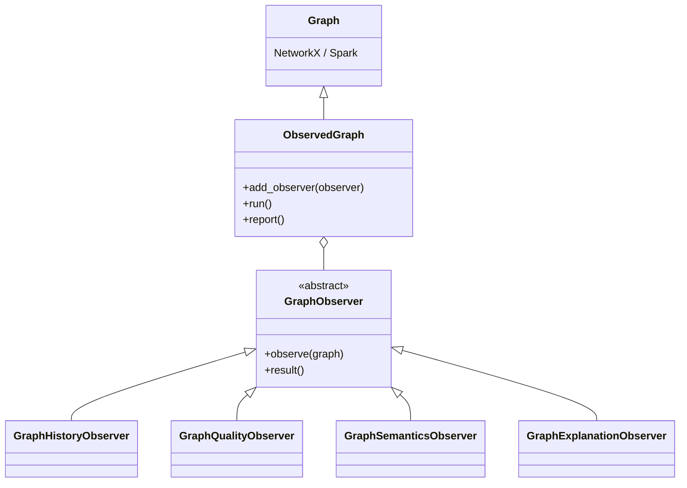

# Proposal: Graph Observers & ObservedGraph

## Core Idea

We want to extend mercury-graph with tools to make it more enterprise-friendly. For that we provide:

- semantic meaning (combined with some metadata, we enable answering business questions)
- integrity and quality checks
- change tracking
- explainability of relationships
- executive and audit-ready reporting

### Why?

Conceptually, this is a class `ObservedGraph` that:

- focuses on translating business insights and applying governance to graphs
- assumes the graph is periodically updated whose lifecycle is important
- computes derived, auditable artifacts using dedicated components derived from `GraphObserver`
- produces enterprise-friendly outputs (PDF, metadata as JSON for dashboards, etc.)

Think of it as:

> *A governed, observable, and explainable view of a graph.*

### How?

```python
g = ObservedGraph(graph)

g.add_observer(GraphHistoryObserver( <arguments> ))
g.add_observer(GraphQualityObserver( <arguments> ))
g.add_observer(GraphExplanationObserver( <arguments> ))

g.run()

report = g.report()
report.generate_pdf( <path> )
```

### Why This Fits mercury-graph

- Builds *on top of* existing graph libraries
- Reinforces clarity, simplicity, and usability
- Adds value where generic graph tools stop
- Aligns naturally with regulated, enterprise use cases
- Can be implemented incrementally

### Class diagram


## Key Abstractions

### `GraphObserver` (Base Class)

A `GraphObserver` is a component that:

- implements the shared logic required
- the implementation of the computation of features is done by subclasses


### `ObservedGraph` (Coordinator)

`ObservedGraph` is a container that:

- wraps an existing graph.graph with a predecessor (possibly recursively)
- registers one or more `GraphObserver` instances
- coordinates their execution
- aggregates their outputs
- generates a **single, coherent report**


## Example Observers

### 1. `GraphSemanticsObserver`

Defines what the graph *means*.

Responsibilities:
- typed nodes and edges
- explicit relationship semantics
- required and optional attributes
- shared vocabulary across teams

This observer establishes a **semantic contract** for graph data, enabling
consistent interpretation across analytical and business use cases.

---

### 2. `GraphQualityObserver`

Ensures the graph conforms to expectations.

Responsibilities:
- validation of data quality
- easy to extend with custom rules

This observer provides **confidence and safety** without enforcing runtime
constraints or modifying the graph.

---

### 3. `GraphHistoryObserver`

Tracks how the graph evolves over time.

Responsibilities:
- tracking changes in data
- tracking changes in distribution (drift, etc.)
- tracking growth and churn metrics

This observer enables **auditability, governance, and lifecycle analysis**.

---

### 4. `GraphExplanationObserver`

Explains relationships in the graph.

Responsibilities:
- path-based explanations between entities
- extraction of evidence subgraphs
- identification of intermediary nodes, alternative paths, etc.

This observer supports **regulatory justification and analytical transparency**.


## APENDIX: The diagram as Mermaid source

See: https://mermaid.live/edit

