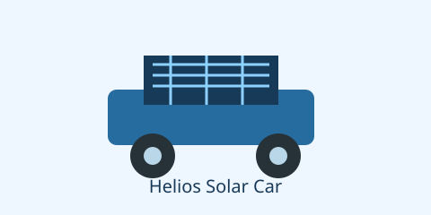

# Riverside Robotics Club

The Riverside Robotics Club is a student club at [Riverside High School](school.md).

Elena Ruiz is the science teacher at Riverside High School. She advises the
Riverside Robotics Club.



## The Helios project

The club built the Helios Solar Car for the [Brookdale Science Fair](science_fair.md).
Noah Kim leads the Helios project.

### The team

Noah Kim is a student at Riverside High School. Priya Shah is also a student at
Riverside High School.

- Noah Kim builds the car body.
- Priya Shah connects the battery.
- Elena Ruiz checks the safety plan.

1. The team chooses a design.
2. The team builds the solar car.
3. The team tests the solar car.

#### Equipment

| Item | Owner | Use |
| --- | --- | --- |
| Solar panel | Riverside Robotics Club | Collects sunlight |
| Battery | Riverside Robotics Club | Stores energy |
| Small motor | Noah Kim | Moves the car |

> Elena Ruiz says that the team should test the car before the science fair.

##### Test day

The team tests the Helios Solar Car in the science laboratory.

```text
Project: Helios Solar Car
Team leader: Noah Kim
Teacher: Elena Ruiz
Location: science laboratory
```

---

###### Project note

The science laboratory is inside Riverside High School.[^lab]

[^lab]: The laboratory has tables, tools, and a charging station.
