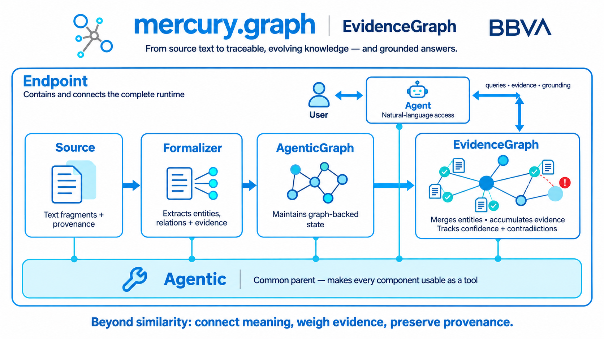

# mercury-graph Evidence Introduction

----

> **Early release — developer and research preview**
>
> Version **3.3.1** is the first release of **EvidenceGraph**. It is intended for developers and researchers who want to help shape a well-defined idea at an early stage: building traceable, evidence-aware knowledge graphs from text.
>
> This release provides the core structure and enough working code to explore, extend and test that direction. **It does not yet provide settled answers to many of its most important design questions** -- for example, how entities and relations should best be resolved and merged; how agents should use graph tools effectively; and how an EvidenceGraph should be queried reliably through natural language.
>
> **All main classes also have known limitations** that will need to be addressed as the library evolves. EvidenceGraph is therefore **not ready for productive use**. We discourage production deployments at this stage and cannot support them.
>
> If you are interested in experimenting, contributing, challenging assumptions and helping build a community around this approach, this is the right time to join. We will clearly communicate when the library is ready for productive use.
----

**EvidenceGraph turns source text into an evolving graph of claims, evidence, and relationships that agents query in natural language.**

It complements vector retrieval with a structured representation of meaning: entities can be connected across fragments, evidence
remains traceable to its source and both reinforcement and contradiction can be represented explicitly.

> **Embeddings approximate relevance. Graphs represent meaning.**

EvidenceGraph does not replace retrieval-augmented generation (RAG). It can be used alongside it: vector search finds text that
looks relevant, while the graph connects what that text says and preserves the evidence behind those connections.

## Why use an evidence graph?

The graph structure enables capabilities that are difficult to obtain from independent chunks of text:

- Find answers whose supporting information is distributed across several fragments, even when no single fragment resembles the question.
- Connect entities and relations deterministically instead of relying only on semantic similarity.
- Preserve the original evidence and provenance behind every extracted relationship.
- Accumulate reinforcing evidence and adjust confidence as new sources arrive.
- Represent contradictions without silently replacing one claim with another.
- Combine structured graph queries with conventional RAG when both are useful.

The result is inspectable rather than opaque: an answer can be followed from a relation, through its supporting evidence, back to the
source text.

## From text to structured evidence

Each source fragment — one sentence, several sentences, a document section or a conversation turn — is converted into a small
evidence subgraph:

- Entities become nodes.
- Extracted relations become edges.
- The original text becomes traceable evidence attached to those relations.
- Extraction confidence and source metadata remain available for later evaluation.

These subgraphs are not treated as isolated facts. They are contributions to a persistent graph that records what was claimed, where
it was found and how strongly it is supported.

## An evolving structured memory

As more text is processed:

- Equivalent entities can be merged.
- Relations accumulate supporting evidence.
- Confidence can evolve as evidence is reinforced or challenged.
- Conflicting claims can coexist and be represented explicitly.
- Provenance remains attached throughout aggregation and retrieval.

The EvidenceGraph therefore models **claims and evidence**, not immutable facts. Imperfect extraction remains useful because every
result stays traceable and can be inspected, corrected or re-evaluated.

## Grounded interaction through agents

An `Agent` uses an `EvidenceGraph` as an external knowledge source and reasoning tool. Instead of placing the entire graph in the
model context, the agent accesses it through focused tools that can:

- Query entities and relations.
- Retrieve the evidence supporting a claim.
- Follow connections across multiple sources.
- Disambiguate references to similar or ambiguous entities.
- Compare reinforcement and contradiction.
- Ground a natural-language response in traceable source material.

This keeps graph storage and graph operations outside the language model while allowing the model to decide what to query and how to
explain the result.

## Main classes

[Agentic](evidence.md#mercury.graph.evidence.Agentic) ·
[Source](evidence.md#mercury.graph.evidence.Source) ·
[AgenticGraph](evidence.md#mercury.graph.evidence.AgenticGraph) ·
[Formalizer](evidence.md#mercury.graph.evidence.Formalizer) ·
[EvidenceGraph](evidence.md#mercury.graph.evidence.EvidenceGraph) ·
[Agent](evidence.md#mercury.graph.evidence.Agent) ·
[Endpoint](evidence.md#mercury.graph.evidence.Endpoint)

- **[`Agentic`](evidence.md#mercury.graph.evidence.Agentic)** is the common parent that gives the components an agent-compatible interface
  and makes their capabilities available as tools.
- **[`Source`](evidence.md#mercury.graph.evidence.Source)** represents corpora in PDF, XML or markdown formats that can be
  inspected and traversed creating unique ids of every node in the tree (from an entire corpus to a cell of a table inside a
  sub-sub-section of a document).
- **[`AgenticGraph`](evidence.md#mercury.graph.evidence.AgenticGraph)** makes mercury.graph MultiGraph available through the Agentic
  interface to contain ontologies for the EvidenceGraph, storage of known entities and relations or any other graph.
- **[`Formalizer`](evidence.md#mercury.graph.evidence.Formalizer)** converts source fragments into structured entities and relations with
  traceable ids for the EvidenceGraph.
- **[`EvidenceGraph`](evidence.md#mercury.graph.evidence.EvidenceGraph)** maintains the aggregated evidence graph, including entity
  resolution and merging relations to manage support, confidence and contradictions.
- **[`Agent`](evidence.md#mercury.graph.evidence.Agent)** integrates llm agents into the graph. These agents can use tools or be used as
  tools themselves. They can also perform EvidenceGraph maintenance and querying in natural language.
- **[`Endpoint`](evidence.md#mercury.graph.evidence.Endpoint)** contains and connects the runtime pieces, exposing a coherent entry point
  for a complete system and the maintenance of all its content and state.

Together, `Source`, `Formalizer`, `AgenticGraph` and `EvidenceGraph` form the maintenance path from source material to structured memory.
`Agent` provides the natural-language interaction layer, `Endpoint` connects the complete runtime and their shared `Agentic` interface
allows each component to participate as a tool.
